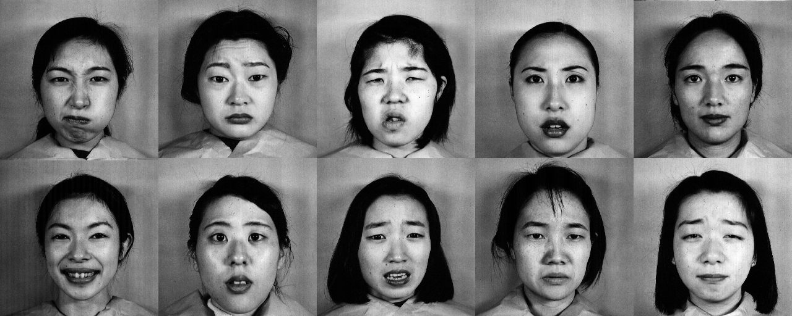

# 基于Fisher算法的人脸识别
## 文档说明
compare.py 欧式距离判别

main.py    Fisher算法的人脸识别测试与求优

evaluate.py  用于验证评估

train.py  用于训练新的人脸库

faces      人脸数据库

faces_test  人脸测试集

jaffe    源数据集

Fisher算法.docx  Fisher算法的论文部分

imgs        存放图片

## 数据集
[The Japanese Female Facial Expression (JAFFE) Database](https://zenodo.org/record/3451524)
### 数据集简介
The database contains 213 images of 7 facial expressions (6 basic facial expressions + 1 neutral) posed by 10 Japanese female models. Each image has been rated on 6 emotion adjectives by 60 Japanese subjects. The database was planned and assembled by Michael Lyons, Miyuki Kamachi, and Jiro Gyoba. We thank Reiko Kubota for her help as a research assistant. The photos were taken at the Psychology Department in Kyushu University.



### 如何使用
安装依赖包
```
pip install -r requirements.txt
```
如果你只是想evaluate，你可以只安装opencv2
```
pip install opencv-python
```
#### evaluate
```
python evaluate.py --param_save_path "./param" --valid_data_path "faces_test"
```
#### train
##### 自定义数据集
你的数据集文件夹结构应该如下：
```
- dataset name
    - person1
        - picture1
        - picture2
        ...
    - person2
        - picture1
        - picture2
        ...
    ...
```
同时你的测试集文件夹结构也应如上；

##### 运行
```
python .\train.py --k 10 --dsize=10
```
关于更多参数你可以执行`python .\train.py --help`来查看。
