# 基于经典算法和BP神经网络的性别识别
## 1.文档说明
~~~
face_recignition_classic
├── README.md 说明文档
├── imgs 存放图片
│   ├── dataset.png
│   └── src
├── rawdata 人脸数据集
├── face 人脸卷标
│   ├── faceDR 
│   └── faceDS
├── add_knn.ipynb 加权KNN算法
├── BP.ipynb bp神经网络
├── knn_svm_tree.ipynb 做特征降维的经典算法（knn、svm和决策树）
├── new_knn_svm_tree.ipynb 未做特征降维的经典算法（knn、svm和决策树）
├── raw_data_read_test.py 读rawdata内的文件
~~~
## 2.数据集
总数居4000张人脸图片，男女比例大约6：4，如下:
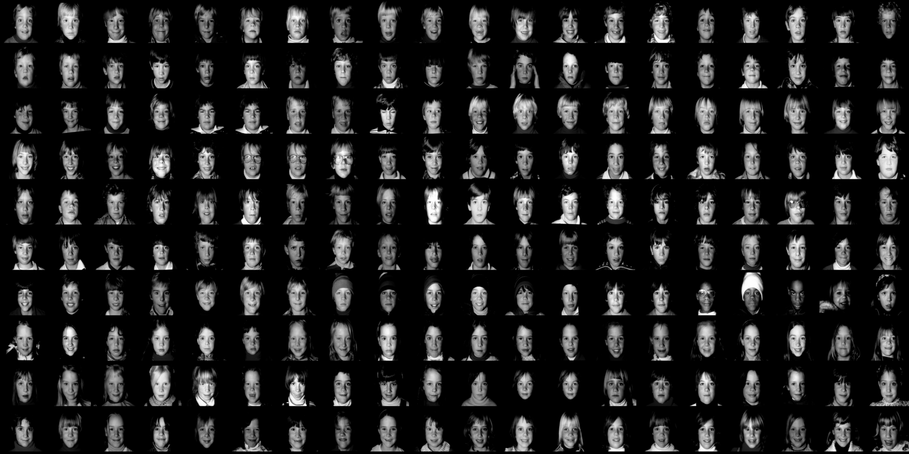

### 2.1数据集处理
由于样本分配稍微有点不均匀，我们采取重采样方式，增加女性的数据，从而使得样本比例基本为1：1；
经过样本的重采样我们最终得到4860个数据。但是存在数据标签缺失的情况，我们实际可使用数据为4500个左右。

4500个数据中，存在相同的人的不同表情等的人脸数据，而且数据相似度较高，于是我们采用了数据增强的方式来提高训练效果。
在实践中发现在数据增强前，数据容易存在过拟合现象，进行了数据增强后，过拟合现象明显减缓。

### 2.2数据集分配
训练集：验证集：测试集 = 8：1：1

训练集和验证集进行k=10的k折交叉验证

## 3.KNN性别分类实现流程

### 3.1 读取数据集的图像和卷标处理<a id="3.1">_</a>

将处理好的数据集的图像读取存到train_images，卷标读取存到train_labels,由于输入的图像过大，我们对图像进行压缩处理，将维度压缩成了100x100的大小,卷标方面由于我们只识别性别，因而只取卷标中的性别分类，对其进行数值化处理，将male处理为1，female为0
~~~
#压缩图像
array_of_img = []
for img in img_list:
    if img is not None:
        img = img / 255.0
        img = cv2.resize(img, (100, 100))
        array_of_img.append(img)
train_images = np.array(array_of_img)
array_of_img = []
#性别标签数值化
array_of_labels = []
for label in label_one_hot:
    if label is not None:
        append_label = label[0]
        array_of_labels.append(int(append_label))
train_labels = np.array(array_of_labels)
array_of_labels = []
~~~

### 3.2 划分训练集和测试集<a id="3.2">_</a>
在开始性别分类前，需要对数据集进行划分成训练集和测试集，训练集用来训练分类器（即确定模型的结构和参数），测试集用来评价分类器的性能（即评估模型的分类准确性）。划分完训练集和测试集需要对其重排列，方便之后的训练和评估
~~~
#划分训练集和测试集 训练集：测试集 = 4：1
X_train, X_test, y_train, y_test = train_test_split(train_images, train_labels, test_size=0.2, random_state=3)
X_train = X_train.reshape(X_train.shape[0], -1)
X_test = X_test.reshape(X_test.shape[0], -1)
~~~

### 3.3 特征降维<a id="3.3">_</a>
压缩后图像的特征空间是10000维度，其中包含与性别识别无关的特征（比如背景）。 可以采用特征降维算法（比如Isomap算法，一种类似PCA的特征提取算法）， 将1000维度的特征降到85维度。在减少无关特征的同时还减少了训练时间。
~~~
# 特征降维
pca = PCA(n_components=85)
newX = pca.fit_transform(X_train)
xx = pca.transform(X_test)
~~~

### 3.4 用k邻近算法去完成分类
这里使用的是sklearn库里的KNeighborsClassifier，参数设为n_neighbors=3，其他值默认
~~~
knn = KNeighborsClassifier(n_neighbors=3)
~~~
通过比较预测结果和真实结果来得到分类准确率，下图得到的是knn训练的准确率约为82.30%
~~~
knn.fit(newX, y_train)
y_pred_on_train = knn.predict(xx)
acc = metrics.accuracy_score(y_test, y_pred_on_train)
~~~
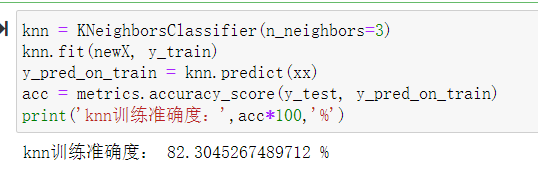

### 3.5 参数n_neighbors(k值)的选取
在关于k值的选取，我采用的是k=10的k折交叉验证去寻找knn算法的最优k值

交叉验证的作用有两点：

* 在数据集很小的时候能防止过拟合
* 找到合适的模型参数

交叉验证需要对数据集进行重新划分，可以先将数据集划分为训练集和测试集，再对训练集划分为子训练集和子测试集，如下图：

我这里主要运用训练集来做交叉验证，从而找到最优k值，因为我们要同时观察训练集的子训练集和测试集的效果随着k的增加而变化情况，所以这里直接用 sklearn.model_selection 中的 vlidation_curve 来完成。

~~~
#交叉验证选取最优k值
from matplotlib import pyplot as plt
from sklearn.model_selection import validation_curve

param_name = 'n_neighbors'
param_range = range(1, 20)

train_scores, test_scores = validation_curve(
    KNeighborsClassifier(), newX, y_train, cv=kfold,
    param_name=param_name, param_range=param_range,
    scoring='accuracy')
#训练集和测试集得分
train_scores_mean = np.mean(train_scores, axis=1)
test_scores_mean = np.mean(test_scores, axis=1)

plt.plot(param_range,train_scores_mean, color='red', label='train')
plt.plot(param_range, test_scores_mean, color='green', label='test')
plt.legend('best')
plt.xlabel('param range of k')
plt.ylabel('scores mean')
plt.show()
~~~

运行完上面代码可以得到下图结果，从图很容易看出k的最优值为1

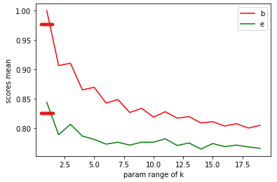

当k=1时，knn训练的准确率约为85.29%,此时k值为最优值

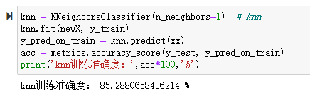

取最优值k值再进行交叉验证观察评估情况，这里使用的是sklearn库里的cross_validate和cross_val_score，使用的是10折交叉验证

cross_val_score是先分片计算后平均的这种方式，可以认为是返回不同模型的平均准确率，cross_validate是会返回每次交叉验证的得分，下图为knn算法交叉验证的结果，从结果看我们的knn算法训练的结果不错，训练时间最短
~~~
kfold = KFold(n_splits=10)
knn_scores = cross_val_score(knn, newX, y_train, cv=kfold)
cv_cross_knn = cross_validate(knn, newX, y_train, cv=kfold, scoring=('accuracy', 'f1'))
print("knn Accuracy: %0.2f (+/- %0.2f)" % (knn_scores.mean(), knn_scores.std() * 2))
print("knn测试结果：",cv_cross_knn)
~~~

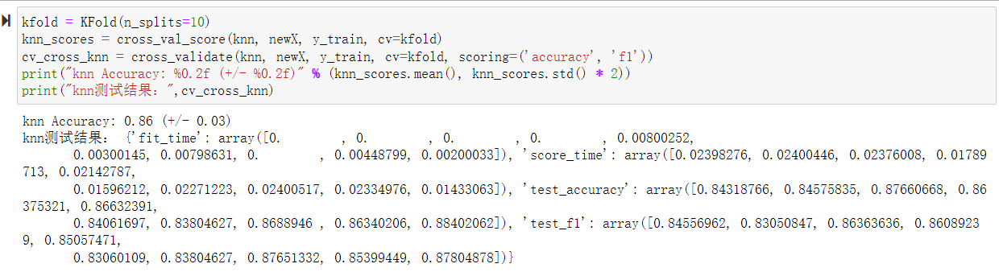

## 4.加权KNN性别分类实现流程

### 4.1加权KNN算法的原理

通过结合KNN本身的分类算法以及对前k个距离加权，来达到分类的目的 wk-nnc算法是对经典knn算法的改进，这种方法是对k个近邻的样本按照他们距离待分类样本的远近给一个权值w，w(i)是第i个近邻的权值，其中1 < i < k,h(i)是待测样本距离第i个近邻的距离，下面是代码实现流程

~~~
#加权KNN
def kNNClassify(inX, dataSet, labels, k = k):
    distance = np.sum(np.power((dataSet - inX), 2), axis = 1) # 计算欧几里得距离
    sortedArray = np.argsort(distance, kind = "quicksort")[:k]
    # 给距离加入权重
    w = []
    for i in range(k):
        w.append((distance[sortedArray[k-1]] - distance[sortedArray[i]]) / (distance[sortedArray[k-1]] - distance[sortedArray[0]]))
 
    count = np.zeros(893)
    temp = 0
    for each in sortedArray:
        count[labels[each]] += 1 + w[temp]
        temp += 1
 
    label = np.argmax(count) # 如果label中有多个一样的样本数，那么取第一个最大的样本类别
    return label
~~~

由于<a href="#3.1">读取数据集的图像和卷标处理</a>、<a href="#3.2">划分训练集和数据集</a>  和<a href="#3.3">特征降维</a>的操作与KNN算法的一样，详情请点前面跳转

### 4.2用加权KNN算法进行分类

这里我选用了k的范围为1-20，运行add_knn.ipynb文件，可以得到下图结果

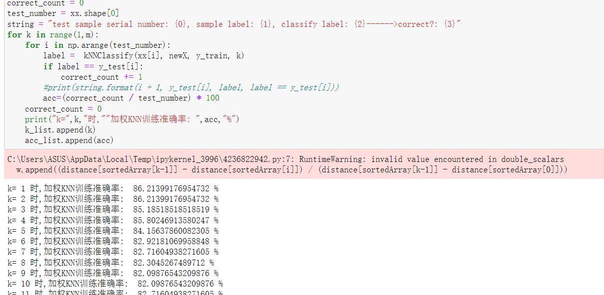

将不同k值得到的训练准确率对比，如下图所示，可以看出当k=1时加权KNN算法的训练准确率最大约为86.21%

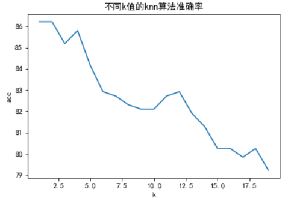

### 4.3加权KNN与KNN算法的对比

取值k值范围为(1,20)，对比加权knn和knn的训练准确率如下图所示，其中蓝线表示的是加权knn的训练准确率，红线表示的是knn的训练准确率，可见加权knn相比较knn的训练准确率有所提高

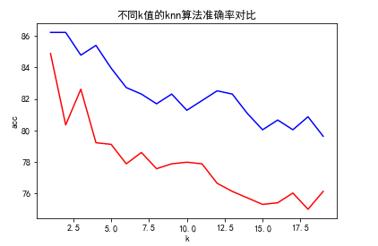

## 5.决策树性别分类实现流程

### 5.1数据处理

由于<a href="#3.1">读取数据集的图像和卷标处理</a>、<a href="#3.2">划分训练集和数据集</a>  和<a href="#3.3">特征降维</a>的操作与KNN算法的一样，详情请点前面跳转

### 5.2用决策树进行性别分类

这里使用的是sklearn库里的DecisionTreeClassifier，参数设为criterion=“entropy”，其他值默认

~~~
tree = tree.DecisionTreeClassifier(criterion="entropy")
~~~

通过比较预测结果和真实结果来得到分类准确率，下图得到的是决策树训练的准确率约为80.35%

~~~
tree.fit(newX, y_train)
score = tree.score(xx,y_test)
print('决策树训练准确率：',score*100,'%')
~~~

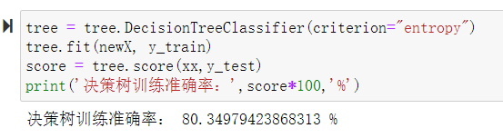

### 5.3 决策树最优参数的选取

这里利用的是网格搜索和10折交叉验证来找最优参数并拟合参数，网格搜索是使用sklearn的gridsearch，用于找出最大深度、随机种子的数量和criterion的最优参数选值
~~~
#创建决策树,用网格搜索和交叉验证找最优参数并拟合数据
def fit_model_k_fold(X, y):
    """ Performs grid search over the 'max_depth' parameter for a 
        decision tree regressor trained on the input data [X, y]. """
    
    # 10折交叉验证
    k_fold = KFold(n_splits=10)
    
    # 建决策树模型
    clf = DecisionTreeClassifier(random_state=80)
    
    params = {'max_depth':range(1,21),'criterion':np.array(['gini','entropy'])}
    # Transform 'accuracy_score' into a scoring function using 'make_scorer' 
    scoring_fnc = make_scorer(accuracy_score)

    # 创建网格搜索
    grid = GridSearchCV(clf, param_grid=params,scoring=scoring_fnc,cv=k_fold)

    # 将网格搜索对象适合数据以计算最佳模型
    grid = grid.fit(X, y)

    return grid.best_estimator_
clf = fit_model_k_fold(newX, y_train)
#打印最优参数的选值
print ("k_fold Parameter 'max_depth' is {} for the optimal model.".format(clf.get_params()['max_depth']))
print ("k_fold Parameter 'criterion' is {} for the optimal model.".format(clf.get_params()['criterion']))
score = clf.score(xx,y_test)
print('最优参数的决策树训练准确率：',score*100,'%')
~~~

运行上面代码可以得到下图结果，可以看到最大深度的最优参数选值为15，criterion = 'entropy'，随机种子数量为80，得到的最优参数的决策树训练准确率约为81.07%

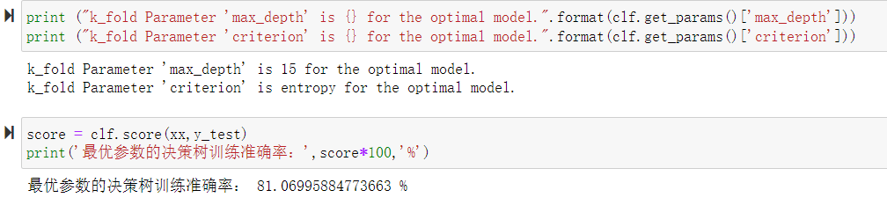

取决策树最优参数再进行交叉验证观察评估情况，这里使用的是sklearn库里的cross_validate和cross_val_score，使用的是10折交叉验证

cross_val_score是先分片计算后平均的这种方式，可以认为是返回不同模型的平均准确率，cross_validate是会返回每次交叉验证的得分，下图为决策树交叉验证的结果，从结果看我们的决策树训练的结果相较于knn算法不太行

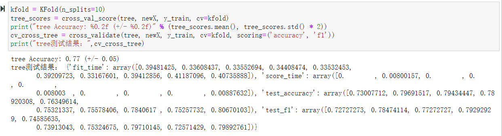

## 6.BP神经网络性别分类实现流程

### 6.1数据处理

由于<a href="#3.1">读取数据集的图像和卷标处理</a>、<a href="#3.2">划分训练集和数据集</a>  和<a href="#3.3">特征降维</a>的操作与KNN算法的一样，详情请点前面跳转

### 6.2数据归一化处理

由于神经网络对数据的尺度比较敏感，所以最好在训练前标准化，或者归一化，或者缩放到[-1,1]
~~~
#归一化
sc = StandardScaler()
sc.fit(X_train)
X_train_std = sc.transform(X_train)
X_test_std = sc.transform(X_test)
~~~

### 6.3用bp神经网络进行性别分类

这里使用的是sklearn库里的MLPClassifier，在参数选择上：

使用的求解器solver = 'lbfgs' ，在MLP的求解方法中，L-BFGS 在小数据上表现较好，Adam 较为鲁棒，SGD在参数调整较优时会有最佳表现（分类效果与迭代次数)，SGD标识随机梯度下降。因而这里选择的是lbfgs

alpha的选择：alpha是L2的参数，MLP是可以支持正则化的，这里使用的是默认值1e-5

hidden_layer_size的选值：这里选用3层神经网络，还有2层隐藏层，其中第1层有5个神经元，第2层有2个神经元

其他参数默认
~~~
bp = MLPClassifier(solver='lbfgs', alpha=1e-5,hidden_layer_sizes=(5,2), random_state=1) 
~~~
通过比较预测结果和真实结果来得到分类准确率，下图得到的是bp神经网络训练的准确率约为86.42%
~~~
bp.fit(X_train_std, y_train)
score = bp.score(X_test_std,y_test)
print('bp神经网络训练准确率：',score*100,'%')
~~~

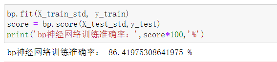

### 6.4bp网络调参

这里利用的是网格搜索和10折交叉验证来找最优参数并拟合参数，网格搜索是使用sklearn的gridsearch，用于找出hidden_layer_sizes、solver和alpha的最优参数选值

~~~
from sklearn.model_selection import train_test_split
from sklearn.model_selection import GridSearchCV
from sklearn.model_selection import KFold
from sklearn.metrics import make_scorer
import numpy as np

k_fold = KFold(n_splits=10)
bp = MLPClassifier(random_state=1) 
params = {"hidden_layer_sizes": [(100,), (100,30),(5,2)],
              "solver": ['adam', 'sgd', 'lbfgs'],
              "alpha" : np.arange(1e-5,1e-4,1e-5),
              "max_iter": [20],
              "verbose": [True]
                             }
scoring_fnc = make_scorer(accuracy_score)
grid = GridSearchCV(bp, param_grid=params,scoring=scoring_fnc,cv=k_fold)
grid = grid.fit(X_train, y_train)
clf = grid.best_estimator_
print ("k_fold Parameter 'hidden_layer_sizes' is {} for the optimal model.".format(clf.get_params()['hidden_layer_sizes']))
print ("k_fold Parameter 'solver' is {} for the optimal model.".format(clf.get_params()['solver']))
print ("k_fold Parameter 'alpha' is {} for the optimal model.".format(clf.get_params()['alpha']))
score = grid.score(X_test,y_test)
print('最优参数的bp神经网络训练准确率：',score*100,'%')
~~~

运行上面代码可以得到下图结果，可以看到hidden_layer_sizes = (100,30), solver = 'adam'，alpha = 1e-5 ，得到的最优参数的bp神经网络训练准确率约为88.89%，可以分析当隐藏层数增多时，能增加其准确率，同时采用的求解器为adam，在多层隐藏层有较好的表现

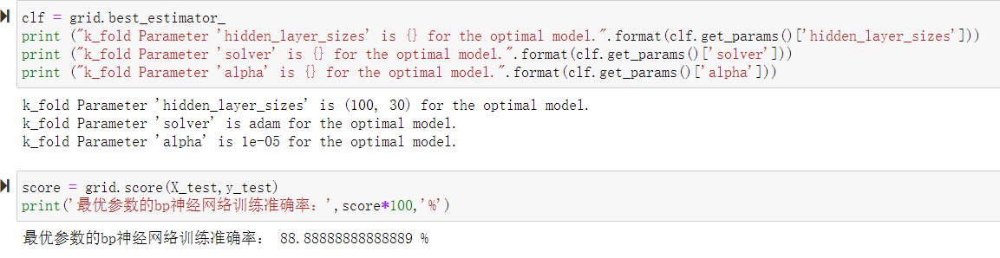

取bp神经网络算法最优参数再进行交叉验证观察评估情况，这里使用的是sklearn库里的cross_validate和cross_val_score，使用的是10折交叉验证

cross_val_score是先分片计算后平均的这种方式，可以认为是返回不同模型的平均准确率，cross_validate是会返回每次交叉验证的得分，下图为bp神经网络交叉验证的结果，从结果看我们的bp神经网络的训练结果不错，但训练时间相较于其他算法略长

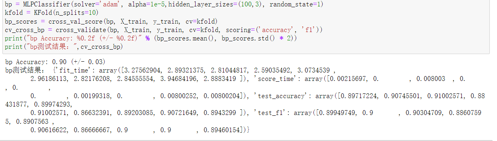

## 7.SVM向量机性别分类实现流程

### 7.1数据处理

由于<a href="#3.1">读取数据集的图像和卷标处理</a>、<a href="#3.2">划分训练集和数据集</a>  和<a href="#3.3">特征降维</a>的操作与KNN算法的一样，详情请点前面跳转

### 7.2用SVM向量机进行性别分类

这里使用的是sklearn库里的svm.SVC，所有参数全部默认

~~~
svm = sklearn.svm.SVC()                    # svm
~~~

通过比较预测结果和真实结果来得到分类准确率，下图得到的是SVM训练的准确率约为85.60%

~~~
svm.fit(newX, y_train)
y_pred_on_train_svm = svm.predict(xx)
acc_svm = metrics.accuracy_score(y_test, y_pred_on_train_svm)
print('svm训练准确度：',acc_svm*100,'%')
~~~

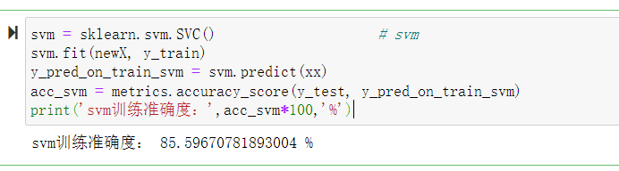

### 7.3SVM调参

这里利用的是网格搜索和10折交叉验证来找最优参数并拟合参数，网格搜索是使用sklearn的gridsearch，用于找出kernel、gamma和C的最优参数选值

~~~
from sklearn.model_selection import train_test_split
from sklearn.model_selection import GridSearchCV
from sklearn.metrics import classification_report
from sklearn.svm import SVC
from sklearn.metrics import make_scorer

k_fold = KFold(n_splits=10)
params = [{'kernel': ['rbf'], 'gamma': [1e-3, 1e-4],
                     'C': [1, 10, 100, 1000]},
                    {'kernel': ['linear'], 'C': [1, 10, 100, 1000]}]

scoring_fnc = make_scorer(accuracy_score)
grid = GridSearchCV(svm, param_grid=params,scoring=scoring_fnc,cv=k_fold)
grid = grid.fit(newX, y_train)
clf = grid.best_estimator_
print ("k_fold Parameter 'gamma' is {} for the optimal model.".format(clf.get_params()['gamma']))
print ("k_fold Parameter 'kernel' is {} for the optimal model.".format(clf.get_params()['kernel']))
print ("k_fold Parameter 'C' is {} for the optimal model.".format(clf.get_params()['C']))
score = grid.score(xx,y_test)
print('最优参数的svm向量机训练准确率：',score*100,'%')
~~~

运行上面代码可以得到下图结果，可以看到gamma = 1e-3, kernel = 'rbf'，C = 1000 ，得到的最优参数的svm训练准确率约为91.15%，可以看到但惩罚系数C增大时，svm的训练准确率也会提高

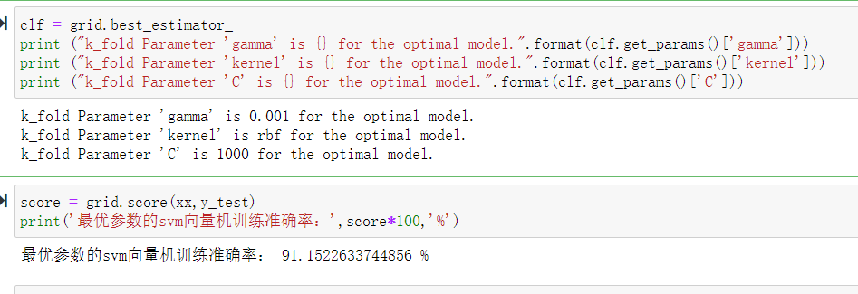

取svm算法最优参数再进行交叉验证观察评估情况，这里使用的是sklearn库里的cross_validate和cross_val_score，使用的是10折交叉验证

cross_val_score是先分片计算后平均的这种方式，可以认为是返回不同模型的平均准确率，cross_validate是会返回每次交叉验证的得分，下图为bp神经网络交叉验证的结果，从结果看我们的svm的训练结果最好，训练时间相较于其他算法略长，但仍低于bp神经网络的训练时间

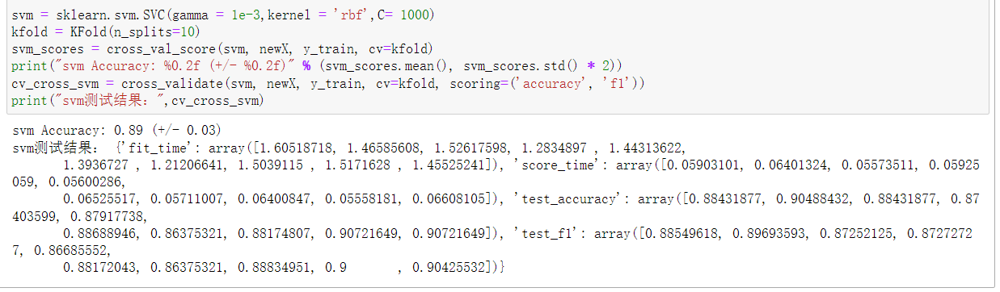

## 8.结论
在前面我们使用了多个算法去实现性别分类的流程，其中的经典算法有KNN算法、SVM支持向量机算法、决策树算法，还有bp神经网络算法，改进算法有加权KNN算法，不同的算法最后得到不同的训练准确率，我们都有根据交叉验证和网格搜索进行其最优参数的选取，进一步提升算法的准确率和降低算法的误差率，在这些算法里表现得最好的是svm算法，准确率高达91.15%，但他的训练时间略长，但仍低于bp神经网络的训练时间，且bp神经网络的准确率居第二，其中knn算法所用的训练时间最短，决策树算法的准确率排最低