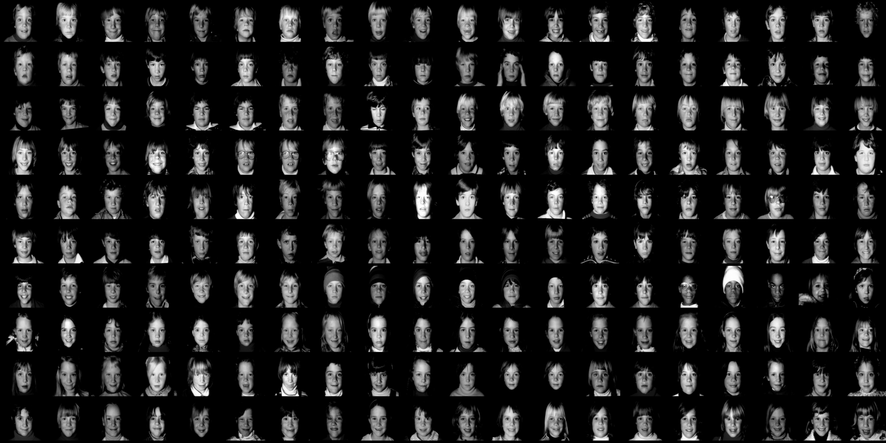

<!--
  -*- coding: utf-8 -*-
 @DATE      : 2022/6/13
 @Author    : Chen HanJie
 @FileName  : README.md
 @Project   : PR
 -->

# 基于CNN性别识别
## 数据集
总数居4000张人脸图片，男女比例大约6：4，如下:

### 数据集处理
由于样本分配稍微有点不均匀，我们采取重采样方式，增加女性的数据，从而使得样本比例基本为1：1；
经过样本的重采样我们最终得到4860个数据。但是存在数据标签缺失的情况，我们实际可使用数据为4500个左右。

4500个数据中，存在相同的人的不同表情等的人脸数据，而且数据相似度较高，于是我们采用了数据增强的方式来提高训练效果。
在实践中发现在数据增强前，数据容易存在过拟合现象，进行了数据增强后，过拟合现象明显减缓。

### 数据集分配
训练集：验证集：测试集 = 8：1：1

训练集和验证集进行k=10的k折交叉验证

## 神经网络模型
### 1. 原始模型
我们开始想法是通过深度较深的卷积模型来识别图片，为了防止深度神经网络（DNN）隐藏层过多时的网络退化问题，我们使用了残差网络。
并且使用输出层使用(1*1)的卷积核来实现降维，从而代替全连接层来减少模型的参数。

综上所述，我们使用了全卷积深度残差网络，模型输入为（n\*128\*128\*1），输出为（n\*2）。

具体模型结果如下：

[原图](.\output\model_full_acc94\model.png)

### 2. 简化模型

### 3. 简化模型含全连接

### 4. 拓宽模型

为了增加模型的鲁棒性，我们将原始模型的残差通道拓展至三条。

具体如下图：

[原图](.\output\model_deep_wise_acc94\model.png)

## 训练策略

### 损失函数选择

本任务为二分类任务，故选择交叉熵损失函数。

### 优化器选择

在比较了adam和sgd后，发现使用adam优化时，模型经常难以收敛，而使用sgd收敛比较稳定，不会存在模型不收敛的情况。